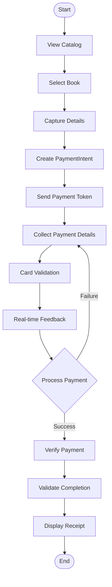

# Stripe Press Book Store

A modern e-commerce application demonstrating Stripe payment integration with a basic digital book store, built with Node.js. This implementation showcases secure payment processing, real-time validation, and a seamless checkout experience.

## Core Features

- **Modern Payment Processing**: Integration of Stripe Elements for secure payment collection
- **Real-time Validation**: Immediate feedback on payment information
- **Responsive Design**: Bootstrap 4.6-based interface that works across all devices
- **Secure Architecture**: Server-side validation and secure payment handling
- **Error Management**: Comprehensive error handling and user feedback

## Installation

1. Clone the repository and install dependencies:
```bash
git clone https://github.com/therealkevops/sa-thp-solution.git
cd sa-thp-solution/
npm install
npm install dotenv stripe
```

2. Configure environment variables:
```bash
cp sample.env .env
```

Add your Stripe API credentials to `.env`:
```
STRIPE_PUBLISHABLE_KEY=pk_test_...
STRIPE_SECRET_KEY=sk_test_...
```

3. Start the development server:
```bash
node --watch app.js
```

The application will be available at `http://localhost:3000`

## Payment Processing Flow

1. **Item Selection**
   - Customer selects a book from the catalog
   - Application captures product details and pricing

2. **Payment Intent Creation**
   - Server creates a PaymentIntent via Stripe API
   - Client receives secure payment token

3. **Payment Information Collection**
   - Stripe Elements collects payment details
   - Real-time card validation and formatting

4. **Transaction Processing**
   - Secure payment confirmation through Stripe
   - Immediate success/failure feedback

5. **Transaction Verification**
   - Server validates payment completion
   - Displays comprehensive receipt

### Payment Flow Diagram



## Development Testing

Use these Stripe test cards to simulate various credit card payment scenarios at the customer checkout:

| Card Number | Scenario |
|------------|----------|
| 4242 4242 4242 4242 | Successful payment |
| 4000 0025 0000 3155 | 3D Secure authentication |
| 4000 0000 0000 9995 | Payment declined |

Note, experiation date must be a valid future date however the CVC number can be randomised.

## Security Implementation

### Data Security
- **Elements Integration**: Secure iframe-based components for sensitive data handling [Elements Security](https://docs.stripe.com/security#stripe-elements)
- **Zero Storage**: No sensitive payment data stored on servers [Data Security Guidelines](https://docs.stripe.com/security#data-security)
- **PCI Compliance**: Automatic PCI compliance through Stripe Elements [PCI Requirements](https://docs.stripe.com/security#pci-compliance)
- **Data Encryption**: End-to-end encryption of sensitive information [Data Encryption](https://docs.stripe.com/security#data-security)

### Transaction Security
- **Amount Validation**: Server-side price validation to prevent tampering [Payment Intent Validation](https://docs.stripe.com/api/payment_intents/object#payment_intent_object-amount)
- **Payment Flow**: Multi-step confirmation process for payment integrity [Payment Flow Security](https://docs.stripe.com/security#payment-security)
- **Idempotency Keys**: Prevention of duplicate transactions [Idempotent Requests](https://docs.stripe.com/api/idempotent_requests)
- **Fraud Prevention**: Built-in fraud detection and prevention tools [Fraud Prevention](https://docs.stripe.com/fraud-prevention)

### Infrastructure Security
- **HTTPS/TLS**: Enforced secure connections for all API communications [Transport Security](https://docs.stripe.com/security#transport-security)
- **Webhook Signatures**: Cryptographic validation of webhook events [Webhook Security](https://docs.stripe.com/webhooks/signatures)
- **API Authentication**: Secure API key management and authentication [Authentication](https://docs.stripe.com/authentication)
- **Error Handling**: Comprehensive security-focused error management [Error Handling](https://docs.stripe.com/error-handling)

## Integrated Stripe APIs

### Payment Elements
- **Secure Payment Collection**: Implements [Payment Element UI Components](https://docs.stripe.com/elements/payment-element)
- **Dynamic Form Validation**: Real-time input validation using [Elements Validation](https://docs.stripe.com/elements/input-validation)
- **Customizable UI**: Styling and branding options via [Elements Appearance API](https://docs.stripe.com/elements/appearance-api)
- **Payment Method Support**: Automatic handling of [diverse payment methods](https://docs.stripe.com/elements/payment-element#payment-methods)

### PaymentIntents API
- **Create**: Initialize payment processing with [PaymentIntent Creation](https://docs.stripe.com/api/payment_intents/create)
- **Retrieve**: Validate payment status using [PaymentIntent Retrieval](https://docs.stripe.com/api/payment_intents/retrieve)
- **Confirm**: Handle payment confirmation with [PaymentIntent Confirmation](https://docs.stripe.com/api/payment_intents/confirm)
- **Authentication Flow**: Support for [Strong Customer Authentication (SCA)](https://docs.stripe.com/strong-customer-authentication)

### Client Integration
- **Stripe.js**: Core client-side integration via [Stripe.js Reference](https://docs.stripe.com/js)
- **Payment Flow**: Complete [Payment Flow Implementation](https://docs.stripe.com/payments/accept-a-payment)
- **3D Secure**: Support for [3D Secure Authentication](https://docs.stripe.com/payments/3d-secure)
- **Error Handling**: Client-side [Error Management](https://docs.stripe.com/error-handling)
- **Events**: Real-time [Payment Event Handling](https://docs.stripe.com/webhooks/payment-events)

## Technical Stack

- **Backend**: Node.js with Express
- **Template Engine**: Handlebars (hbs)
- **Frontend Framework**: Bootstrap 4.6
- **Payment Processing**: Stripe Elements & APIs

## References

- [Stripe Payments Quickstart Documentation](https://docs.stripe.com/payments/quickstart?lang=node#init-elements-html)
- [Stripe.js Reference](https://docs.stripe.com/js)
- Additional debugging and code creation using Cursor + Claude-3.5-sonnet

## Implementation Approach

This solution prioritizes a number of key aspects of Stripe payments integration, which at a high level includes:
- Minimal modification of existing architecture
- Direct integration with Stripe's recommended practices
- Clean separation of concerns
- Robust error handling
- Secure payment processing
