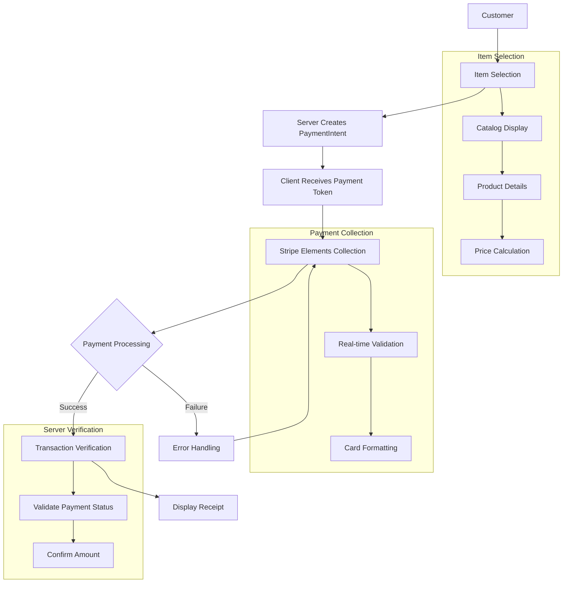

# Stripe Press Book Store

A modern e-commerce application demonstrating Stripe payment integration with Node.js. This implementation showcases secure payment processing, real-time validation, and a seamless checkout experience.

## Core Features

- **Modern Payment Processing**: Integration of Stripe Elements for secure payment collection
- **Real-time Validation**: Immediate feedback on payment information
- **Responsive Design**: Bootstrap 4.6-based interface that works across all devices
- **Secure Architecture**: Server-side validation and secure payment handling
- **Error Management**: Comprehensive error handling and user feedback

## Installation

1. Clone the repository and install dependencies:
```bash
git clone https://github.com/therealkevops/sa-thp-solution.git
cd sa-thp-solution/
npm install
npm install dotenv stripe
```

2. Configure environment variables:
```bash
cp sample.env .env
```

Add your Stripe API credentials to `.env`:
```
STRIPE_PUBLISHABLE_KEY=pk_test_...
STRIPE_SECRET_KEY=sk_test_...
```

3. Start the development server:
```bash
node --watch app.js
```

The application will be available at `http://localhost:3000`

## Payment Processing Flow

1. **Item Selection**
   - Customer selects a book from the catalog
   - Application captures product details and pricing

2. **Payment Intent Creation**
   - Server creates a PaymentIntent via Stripe API
   - Client receives secure payment token

3. **Payment Information Collection**
   - Stripe Elements collects payment details
   - Real-time card validation and formatting

4. **Transaction Processing**
   - Secure payment confirmation through Stripe
   - Immediate success/failure feedback

5. **Transaction Verification**
   - Server validates payment completion
   - Displays comprehensive receipt

### Payment Flow Diagram



## Development Testing

Use these Stripe test cards to simulate various scenarios:

| Card Number | Scenario |
|------------|----------|
| 4242 4242 4242 4242 | Successful payment |
| 4000 0025 0000 3155 | 3D Secure authentication |
| 4000 0000 0000 9995 | Payment declined |


## Security Implementation

- Stripe Elements handles sensitive card data
- Server-side amount validation prevents tampering
- Secure payment confirmation flow
- Comprehensive error handling
- No sensitive data persistence

## Integrated Stripe APIs

### Payment Elements
- Secure payment information collection
- Dynamic form validation
- Customizable UI components

### PaymentIntents API
- `create`: Initializes payment processing
- `retrieve`: Validates payment status
- Handles authentication requirements

### Client Integration
- Stripe.js for secure token handling
- Payment confirmation management
- 3D Secure authentication support

## Technical Stack

- **Backend**: Node.js with Express
- **Template Engine**: Handlebars (hbs)
- **Frontend Framework**: Bootstrap 4.6
- **Payment Processing**: Stripe Elements & APIs

## References

- [Stripe Payments Documentation](https://docs.stripe.com/payments/quickstart?lang=node#init-elements-html)
- [Stripe.js Reference](https://docs.stripe.com/js)

## Implementation Approach

This solution prioritizes:
- Minimal modification of existing architecture
- Direct integration with Stripe's recommended practices
- Clean separation of concerns
- Robust error handling
- Secure payment processing
